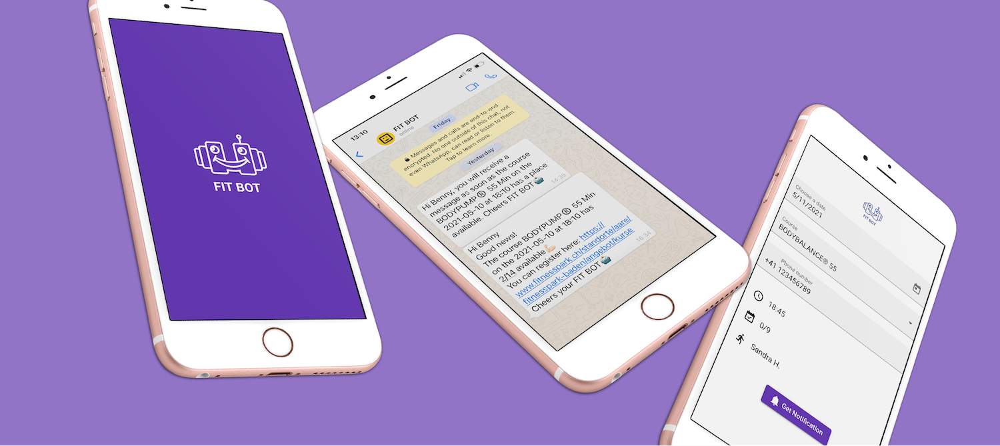

# FIT BOT

[](https://github.com/benjaminkech/fit-bot/actions/workflows/azure-static-web-apps-black-ocean-0249d7603.yml)



FIT BOT is a helper to inform me when a fully booked course at my local gym has a spot available. If the registration for the gym session is not open yet, FIT BOT tells me when the registration begins. As soon as a spot in the gym course is available, I receive a message on my phone. With this handy tool, I can hopefully save myself a place in my favorite sessions more frequently.

## Run the frontend and API locally
- Set GYM_API and TRIGGER_API in api/local.settings.json.
- Run ```swa start fit-bot-app/dist/fit-bot-app --api-location api```
